<div align="center">
  
</div>

<div align="center">
  <a href="https://raahim.dev"></a>
  <a href="https://www.linkedin.com/in/raahim-f"></a>
  <a href="mailto:raahim.farhan@mail.utoronto.ca"></a>
</div>

<br />

## `whoami`

```ts
const raahim = {
  education: "Computer Science @ University of Toronto",
  focus: ["full-stack systems", "edge-native apps", "developer experience"],
  currentlyBuilding: ["production LMS workflows", "real-time dashboards", "high-traffic web platforms"],
  principles: ["derive state", "ship securely", "measure the result"],
};
```

I turn fuzzy product requirements into systems that feel simple on the surface and stay reliable underneath. My favorite work sits where polished interfaces meet backend architecture, real-time data, and edge constraints.

## Selected impact

<table>
  <tr>
    <td width="33%" valign="top">
      <h3>⚡ 14,000+ students</h3>
      Rebuilt a 50+ page student-union platform with Astro, React, and Cloudflare Pages—and compressed its image footprint from ~492 MB to ~22 MB.
    </td>
    <td width="33%" valign="top">
      <h3>🛰️ Edge-native</h3>
      Built a six-role request portal with Kanban workflows, chat, audit history, R2 storage, and hand-rolled Web Push for the edge runtime.
    </td>
    <td width="33%" valign="top">
      <h3>🔐 Secure by design</h3>
      Shipped timing-safe auth, HMAC-verified webhooks, JWT hygiene, rate limiting, and protected PDF delivery for a production LMS.
    </td>
  </tr>
</table>

## Toolbox

<div align="center">
  
</div>

## Public playground

<table>
  <tr>
    <td width="50%" valign="top">
      <h3><a href="https://github.com/MrHypotenuse/EbikeMotor">🏍️ Streetster Sound</a></h3>
      Turn a phone into a synthesized e-bike / motorcycle engine—rev it with device motion or an on-screen throttle.
      <br /><br />
      <code>JavaScript</code> <code>Web Audio</code> <code>Device Motion</code>
    </td>
    <td width="50%" valign="top">
      <h3><a href="https://github.com/MrHypotenuse/Space">🌌 Nebula.io</a></h3>
      A cosmic, gravity-driven multiplayer game with a custom canvas renderer, physics systems, evolution mechanics, and Socket.IO.
      <br /><br />
      <code>JavaScript</code> <code>Canvas</code> <code>Socket.IO</code>
    </td>
  </tr>
</table>

<div align="center">
  <sub>Build the useful thing. Make the hard parts invisible.</sub>
</div>
